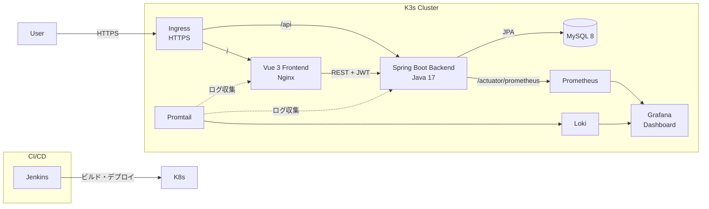

# Incident & Alert Management API

Lightweight Incident & Alert Management system with a Vue 3 frontend, Spring Boot backend, MySQL storage, and Prometheus/Grafana for monitoring.



## Features

- **Dashboard**: real-time statistics, incident trends, and severity distribution.
- **Incidents**: CRUD operations, pagination, status updates, and severity management.
- **Alerts**: alert management workflows and protected API endpoints.
- **Monitoring**: backend availability, request rate, 5xx error rate, p95 latency, JVM health, frontend availability, and MySQL metrics.
- **Grafana integration**: focused Grafana panels are embedded into the frontend through the Nginx `/grafana/` proxy.
- **Authentication**: JWT-based login, protected routes, and role-based authorization.

## Tech Stack

| Category | Technology |
| --- | --- |
| Backend | Java 17, Spring Boot 3, Spring Data JPA |
| Frontend | Vue 3, Vite, Element Plus, Pinia, Chart.js |
| Authentication | Spring Security, JWT |
| Database | MySQL 8 |
| Monitoring | Prometheus, Grafana, mysqld-exporter, Blackbox Exporter |
| Containers | Docker, Docker Compose |
| Orchestration | Kubernetes, K3s |
| CI/CD | Jenkins Pipeline |
| Build | Maven, npm |

## Quickstart: Docker Compose

Prerequisites:

- Docker Desktop and Docker Compose
- Java 17
- Maven
- Node.js and npm for frontend development

Build the backend artifact and start the local stack:

```powershell
.\mvnw.cmd clean package -DskipTests
docker compose up -d --build
```

Access the applications:

| Service | URL |
| --- | --- |
| Frontend | http://localhost:3001 |
| Backend API | http://localhost:8080 |
| Prometheus | http://localhost:9090 |
| Grafana | http://localhost:3000 |

The Docker Compose frontend proxies API requests to the backend. Import [grafana-dashboard.json](grafana-dashboard.json) into Grafana when using the local Compose monitoring stack.

Stop the stack:

```powershell
docker compose down
```

## Local Development

Run the backend from the repository root:

```powershell
.\mvnw.cmd spring-boot:run
```

Run the Vue frontend in a second terminal:

```powershell
cd frontend
npm install
npm run dev
```

## Configuration
- Backend properties: see `src/main/resources/application.properties` for default values and database settings.
- Kubernetes manifests are in the `k8s/` folder. Use overlays for environment-specific configs (e.g., `k8s/overlays/prod`).

## Kubernetes
- A base set of manifests is available at `k8s/base/` for backend, frontend, MySQL, and ingress.
- To deploy to a cluster, adjust secrets (JWT key, DB credentials) and apply manifests with `kubectl apply -k k8s/overlays/<env>`.


## Project structure 

- frontend/: Vue 3 application (Vite)
- src/: Spring Boot backend source
- k8s/: Kubernetes manifests
- docker-compose.yml: local multi-service stack


## Monitoring

This project includes a Grafana + Prometheus monitoring dashboard for service health:  
backend availability, 5xx error rate, p95 latency, frontend availability, MySQL connections, and more.


## プロジェクト名：Incident & Alert Management Dashboard

### 概要
このプロジェクトは、システムの障害（インシデント）とアラートを一元管理するためのWebアプリケーションです。
バックエンドからフロントエンド、インフラ、CI/CD、監視まで、すべてを自分で設計・実装しました。

**目的**：DevOpsやSREのスキルを実践的に学び、クラウドネイティブな環境での運用を経験すること。

---

---

### プロジェクトの中で苦労したこと・解決したこと

| 問題 | 原因 | 解決方法 |
|:---|:---|:---|
| JWT認証で403エラー | 環境変数からJWT_SECRETが正しく読み込めなかった | `System.getenv()` で強制的に読み込むように修正 |
| MySQLに接続できない | データベース未作成 / ユーザー権限不足 | DBを作成し、ユーザーに権限を付与 |
| Nginxがバックエンドにプロキシできない | Service名の間違い / rewriteルール不足 | Service名を修正し、rewriteルールを追加 |
| CoreDNSが動かず名前解決不可 | CoreDNSのforward設定が間違っていた | ConfigMapを修正し、Podを再起動 |
| Prometheusがメトリクスを取得できない（403） | Spring Securityが`/actuator/prometheus`をブロック | SecurityConfigで`permitAll()`に設定 |
| K3dにDockerイメージをインポートできない | k3dの仕様によるdigestエラー | `docker save` + `ctr images import` で手動インポート |

---

### Kubernetes構成
K3sクラスタ上で以下のマニフェストを使ってデプロイ。

| リソース | 用途 |
|:---|:---|
| Namespace | `incident` 名前空間にリソースを隔離 |
| Deployment | バックエンド（2レプリカ）、フロントエンド（2レプリカ） |
| Service | ClusterIPで内部通信 |
| Ingress | 外部アクセスをバックエンド/フロントエンドに振り分け |
| ConfigMap | アプリケーション設定ファイルを管理 |
| Secret | データベースパスワードやJWT_SECRETを管理 |
| StatefulSet | MySQLのデータ永続化（PVC付き） |
| HPA | CPU使用率に応じてPodを自動増減 |
| PDB | メンテナンス時に最低1つのPodが常に稼働 |

---

### CI/CDパイプライン
1. コードをGitHubにプッシュ
2. Jenkinsが自動検知
3. Mavenでビルド → Dockerイメージを作成
4. イメージをDocker Hubにプッシュ
5. KubernetesのDeploymentを更新
6. 必要に応じてロールバック

---

### どうやって動かすか

**必要なもの：**
- Docker & Docker Compose
- Kubernetesクラスタ（K3d推奨）
- Jenkins（CI/CD用）

**ローカルで動かす場合：**
```bash
# リポジトリをクローン
git clone https://github.com/yingruixu/Incident-Alert-Management-API.git

# Docker Composeで起動
cd incident-api
docker-compose up -d

# ブラウザでアクセス
# フロントエンド: http://localhost
# バックエンドAPI: http://localhost:8081
# Prometheus: http://localhost:9090
# Grafana: http://localhost:3000
