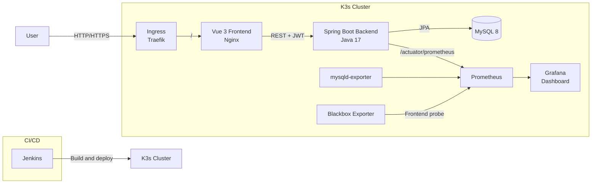

# Incident & Alert Management API

Lightweight Incident & Alert Management system with a Vue 3 frontend, Spring Boot backend, MySQL storage, and Prometheus/Grafana monitoring.

## Architecture



The current K3s deployment separates business workloads and observability:

- `incident` namespace: frontend, backend, and MySQL.
- `monitoring` namespace: Prometheus, Grafana, `mysqld-exporter`, and Blackbox Exporter.
- Prometheus discovers application targets through Kubernetes `ServiceMonitor` resources instead of fixed Pod IP addresses.

Loki and Promtail are reserved for the next observability phase; the current repository focuses on Prometheus metrics and Grafana dashboards.

## Features

- **Dashboard**: real-time statistics, incident trends, and severity distribution.
- **Incidents**: CRUD operations, pagination, status updates, and severity management.
- **Alerts**: alert management workflows and protected API endpoints.
- **Monitoring**: backend availability, request rate, 5xx error rate, p95 latency, JVM health, frontend availability, and MySQL metrics.
- **Grafana integration**: focused Grafana panels are embedded into the frontend through the Nginx `/grafana/` proxy.
- **Authentication**: JWT-based login, protected routes, and role-based authorization.

## Tech Stack

| Category | Technology |
| --- | --- |
| Backend | Java 17, Spring Boot 3, Spring Data JPA |
| Frontend | Vue 3, Vite, Element Plus, Pinia, Chart.js |
| Authentication | Spring Security, JWT |
| Database | MySQL 8 |
| Monitoring | Prometheus, Grafana, mysqld-exporter, Blackbox Exporter |
| Containers | Docker, Docker Compose |
| Orchestration | Kubernetes, K3s |
| CI/CD | Jenkins Pipeline |
| Build | Maven, npm |

## Quickstart: Docker Compose

Prerequisites:

- Docker Desktop and Docker Compose
- Java 17
- Maven
- Node.js and npm for frontend development

Build the backend artifact and start the local stack:

```powershell
.\mvnw.cmd clean package -DskipTests
docker compose up -d --build
```

Access the applications:

| Service | URL |
| --- | --- |
| Frontend | http://localhost:3001 |
| Backend API | http://localhost:8080 |
| Prometheus | http://localhost:9090 |
| Grafana | http://localhost:3000 |

The Docker Compose frontend proxies API requests to the backend. Import [grafana-dashboard.json](grafana-dashboard.json) into Grafana when using the local Compose monitoring stack.

Stop the stack:

```powershell
docker compose down
```

## Local Development

Run the backend from the repository root:

```powershell
.\mvnw.cmd spring-boot:run
```

Run the Vue frontend in a second terminal:

```powershell
cd frontend
npm install
npm run dev
```

Build the frontend for production:

```powershell
cd frontend
npm run build
```

## Kubernetes / K3s

Business workload manifests are under [k8s/base](k8s/base). Monitoring integration resources are under [k8s/monitoring](k8s/monitoring).

Apply the business workloads:

```powershell
kubectl apply -f k8s/base/namespace.yaml
kubectl apply -f k8s/base/mysql
kubectl apply -f k8s/base/backend
kubectl apply -f k8s/base/frontend
```

Install the monitoring stack with Helm:

```powershell
helm repo add prometheus-community https://prometheus-community.github.io/helm-charts
helm repo update
helm upgrade --install monitoring prometheus-community/kube-prometheus-stack `
  --namespace monitoring --create-namespace
```

Install the exporters:

```powershell
helm upgrade --install incident-mysql-exporter prometheus-community/prometheus-mysql-exporter `
  --namespace monitoring --values k8s/monitoring/mysql-exporter-values.yaml

helm upgrade --install incident-blackbox-exporter prometheus-community/prometheus-blackbox-exporter `
  --namespace monitoring --values k8s/monitoring/blackbox-exporter-values.yaml
```

Apply ServiceMonitors and the monitoring Ingress:

```powershell
kubectl apply -f k8s/monitoring/incident-backend-servicemonitor.yaml
kubectl apply -f k8s/monitoring/incident-frontend-blackbox-servicemonitor.yaml
kubectl apply -f k8s/monitoring/ingress.yaml
```

For production, replace development credentials, local hostnames, and anonymous Grafana access with Kubernetes Secrets, TLS certificates, approved DNS, and authenticated access.

## Monitoring Queries

Backend availability:

```promql
100 * avg(up{job="incident-backend"})
```

Backend p95 latency:

```promql
1000 * histogram_quantile(0.95, sum by (le) (rate(http_server_requests_seconds_bucket{job="incident-backend"}[5m])))
```

MySQL availability:

```promql
mysql_up{job="incident-mysql-exporter"}
```

Frontend availability:

```promql
probe_success{job="incident-frontend"}
```

TLS certificate remaining days, when an HTTPS target is configured:

```promql
(probe_ssl_earliest_cert_expiry{job="incident-certificate"} - time()) / 86400
```

## Japanese Project Summary

### プロジェクト名

Incident & Alert Management Dashboard

### 概要

このプロジェクトは、システム障害（インシデント）とアラートを一元管理するWebアプリケーションです。バックエンド、フロントエンド、データベース、Kubernetes、CI/CD、監視までを一つのシステムとして設計・実装しています。

目的は、DevOpsとSREの実践を通して、クラウドネイティブな環境での開発・デプロイ・運用を経験することです。

### 機能一覧

1. **ダッシュボード**：システム状態、障害数、アラート数、トレンドを確認。
2. **インシデント管理**：障害の登録、検索、ステータス更新、解決までを管理。
3. **アラート管理**：アラート情報と対応状況を管理。
4. **監視画面**：Grafanaの主要パネルを埋め込み、可用性、HTTPリクエスト、p95レイテンシ、JVM、MySQLを表示。
5. **ユーザー認証**：JWTとSpring Securityによる認証・認可。

### プロジェクトで対応した課題

| 課題 | 原因 | 対応 |
| --- | --- | --- |
| JWT認証で403が発生 | JWT_SECRETや認証設定が環境ごとに異なっていた | Kubernetes SecretとSpring Security設定を確認し、環境別設定を整理 |
| MySQLに接続できない | DB接続先、ユーザー権限、Service名の不一致 | Kubernetes Service DNS、Secret、DB health checkを確認 |
| Nginxからバックエンドへ接続できない | Service名やrewrite設定の不一致 | Nginx proxy設定とKubernetes Serviceを統一 |
| Prometheusがメトリクスを取得できない | Actuator endpointがSecurityで保護されていた | `/actuator/prometheus`を監視用に公開し、ServiceMonitorを追加 |
| Pod IPを監視設定に固定したくない | Pod再作成時にIPが変わる | ServiceMonitorとKubernetes Service Discoveryを採用 |
| Grafanaをiframeに埋め込めない | iframe制限、subpath、静的リソースのproxy不一致 | `allow_embedding`、Grafana subpath、Nginx proxyを統一 |

## Kubernetes Configuration

| Resource | Purpose |
| --- | --- |
| Namespace | `incident`と`monitoring`で業務系と監視系を分離 |
| Deployment | frontendとbackendを複数レプリカで実行 |
| StatefulSet | MySQLとPVCによるデータ永続化 |
| Service | ClusterIPとKubernetes DNSによる内部通信 |
| ServiceMonitor | Prometheusのアプリケーション自動検出 |
| ConfigMap | アプリケーション設定とGrafana Dashboard provisioning |
| Secret | DB認証情報、JWT_SECRET、exporter認証情報 |
| Ingress | Traefikによる外部HTTP/HTTPSルーティング |

HPAやPDBなどの追加運用機能は、環境要件に応じて `k8s/overlays` へ拡張する想定です。

## CI/CD Pipeline

現在の [Jenkinsfile](Jenkinsfile) は以下を実行します。

1. Git checkout
2. Maven package
3. Backend Docker image build
4. Frontend Docker image build
5. Docker Compose deployment

本番運用では、Docker Registryへのpush、脆弱性スキャン、Kubernetes rollout確認、失敗時のrollbackを追加します。

## Project Structure

```text
frontend/                 Vue 3 application and Nginx configuration
src/main/java/            Spring Boot backend source
src/main/resources/       Application configuration
k8s/base/                 Business workload manifests
k8s/monitoring/           Prometheus, Grafana, and exporter resources
grafana-dashboard.json    Grafana observability dashboard
docker-compose.yml        Local integration stack
Jenkinsfile               Jenkins pipeline
```

## Security Notes

- Do not commit real passwords, JWT secrets, registry credentials, or TLS private keys.
- The Kubernetes Secret files contain development-only values and must be replaced before production use.
- Anonymous Grafana access is convenient for the local embedded dashboard but should be disabled in production.
